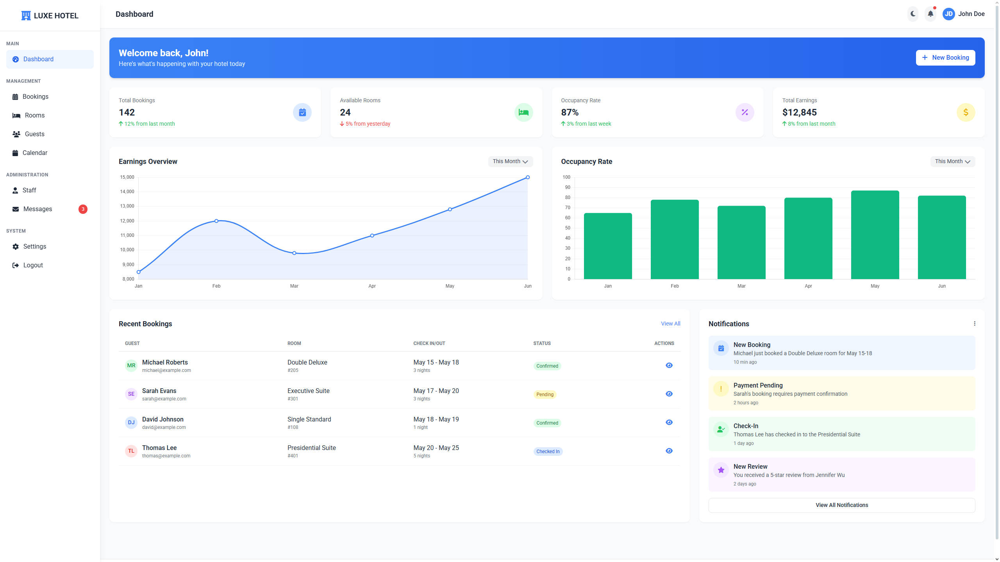

# 🏨 Luxe Hotel – Modern Admin Dashboard

Luxe Hotel Dashboard is a responsive and interactive admin panel built with HTML, TailwindCSS, JavaScript, and Chart.js.
It provides hotel managers with a clean and modern interface to track bookings, rooms, guests, occupancy rates, and earnings — all wrapped in a dark/light mode with elegant animations.

---

## ✨ Features
- Sidebar Navigation with sections for Dashboard, Bookings, Rooms, Guests, Calendar, Staff, Messages, and Settings.
- Stats Cards for quick insights:
- Total Bookings
- Available Rooms
- Occupancy Rate
- Total Earnings
- Interactive Charts powered by Chart.js:
- Earnings Overview
- Occupancy Rate
- Recent Bookings Table with guest info, room type, and booking status.
- Notifications Panel for new bookings, payments, check-ins, and reviews.
- Profile Menu with dropdown for Profile, Settings, and Logout.
- Responsive Design – optimized for desktop and mobile.
- Dark/Light Theme Toggle with LocalStorage persistence.
- Toast Notifications for user actions.
- Logout Modal for confirmation before exiting.

---

## 🛠 How to Use

1. Clone this repository or download the files:
```bash
git clone https://github.com/your-username/luxe-hotel-dashboard.git
```
2. Open index.html in your browser.
3. Explore the dashboard and switch between sections.

---

## 📂 Project Structure
```
luxe-hotel-dashboard/
│
├── index.html     # Main dashboard UI
├── style.css
├── script.css
├── README.md
└── screenshot.png
```

---

## 📸 Screenshots


---

## 📜 License

This project is licensed under the **MIT License** – feel free to use, modify, and distribute.

---

## 💡 Future Improvements

- Integration with real booking APIs.
- Role-based authentication (Admin, Staff).
- Export booking/earnings data as CSV/Excel.
- Calendar synchronization with Google Calendar.
- In-app chat system for staff communication.